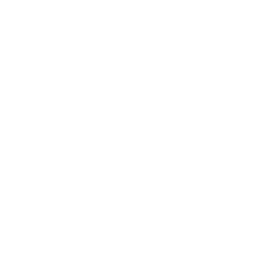
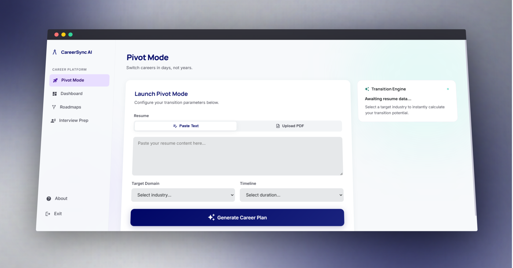
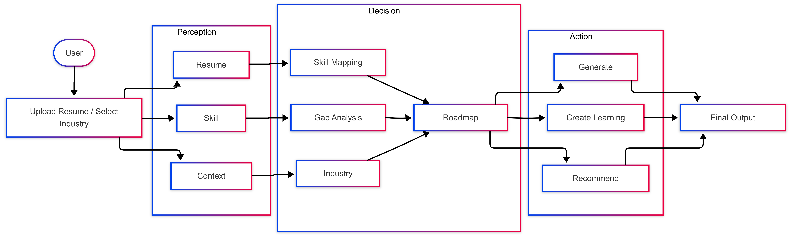
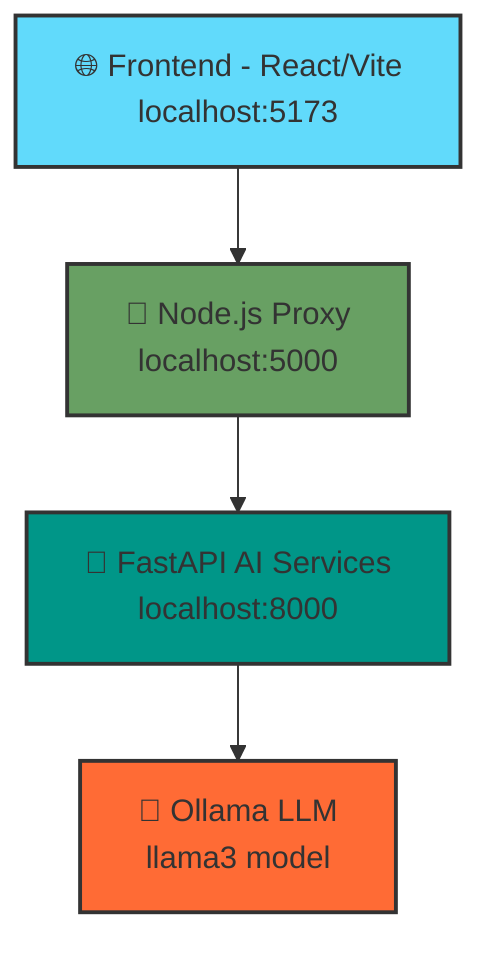

<div align="center">
  
  <h1>CareerSync AI</h1>
  <p><strong>Switch Careers in Days, Not Years.</strong></p>
  
  
  
  
  
  
  
</div>

CareerSync AI is an AI-powered career transition platform — that takes your resume, maps your transferable skills to a target industry, generates a personalised learning roadmap, and prepares you for domain-specific interviews. All inference runs locally via Ollama (no external AI API required).

---

## 📋 Table of Contents

- [🎯 Overview](#-overview)
- [✨ Features](#-features)
- [🏗️ Architecture](#️-architecture)
- [📄 Pages & Routes](#-pages--routes)
- [🤖 AI Agents](#-ai-agents)
- [🛠️ Tech Stack](#️-tech-stack)
- [🚀 Running the Application](#-running-the-application)
- [📚 Documentation](#-documentation)
- [🤝 Contributing](#-contributing)
- [📄 License](#-license)

---

## 🎯 Overview



CareerSync AI solves a real problem: **career switching is hard**. Most people have transferable skills but don't know how they map to a new domain, where to start learning, or how to prepare for interviews in a field they've never worked in.

### 🔄 How Pivot Mode Works

Pivot Mode addresses this by following a systematic 5-step process:

1. **Resume Analysis** - Parsing pasted resume text to extract skills and experience
2. **Skill Mapping** - Mapping existing skills to the target domain using AI
3. **Gap Analysis** - Identifying skill gaps and learning opportunities
4. **Roadmap Generation** - Creating a phased learning roadmap with real study resources
5. **Interview Preparation** - Producing domain-specific interview questions and practice

### 🎨 Key Benefits

- **Fast Career Transitions** - Switch careers in days or weeks, not years
- **Privacy-First** - All AI processing runs locally via Ollama (no external APIs)
- **Personalized Learning** - Tailored roadmaps based on your existing skills
- **Smart Recommendations** - AI-powered job matching and skill gap analysis
- **Interview Ready** - Domain-specific interview preparation and practice

---

## 📄 Pages & Routes

### 🔄 Pivot Mode
- **Smart Resume Analysis** - Paste resume text, select target domain (Healthcare IT, Railway, Finance) and timeline (2 Days, 1 Week, 1 Month)
- **Immersive Processing** - Fullscreen animated loading overlay while AI processes your data
- **Seamless Navigation** - Auto-navigates to Dashboard on completion
- **Session Persistence** - Results persist in app state for the session — navigating away and back does not reset them

### 📊 Dashboard
- **Confidence Metrics** - Overall confidence score, skills detected, skill gaps count, job matches count
- **Visual Skill Analysis** - AI-scored skill relevance bars (0–100%) with interactive displays
- **Job Matching** - Clickable job match cards that open LinkedIn job searches
- **AI Insights** - AI-generated insight and actionable tips for career transition
- **Gap Analysis** - Comprehensive skill gaps list with improvement recommendations

### 🗺️ Roadmap
- **Phased Learning Path** - 4-phase AI-generated roadmap broken down from your selected timeline
- **Interactive Phases** - Click any phase card to view topics and curated study resources
- **Quality Resources** - Each resource links to Coursera, YouTube, freeCodeCamp, Medium, or Google
- **Progress Tracking** - "Mark Phase as Done" button updates market readiness progress circle (0% → 100%)

### 🎤 Interview Prep
- **Interactive Simulation** - AI-powered interview simulation with real-time evaluation
- **Progressive Difficulty** - 5 questions ranging from Easy → Hard, tailored to your target domain
- **Live Scoring** - Real-time tracking of relevance, clarity, depth, and technical accuracy
- **Instant Feedback** - Immediate feedback after each answer with strengths, weaknesses, and improvement suggestions
- **Detailed Analytics** - Comprehensive evaluation modal with granular scores across 4 dimensions
- **Final Report** - Complete assessment with overall score, top strengths, key weaknesses, improvement roadmap, and study topics
- **Smooth UX** - Chat-style interface with auto-scrolling and typing indicators
- **Smart Questions** - Generated based on your specific skill gaps and mapped skills

### 🏠 Landing Page (`/`)
- **Cinematic Design** - Fullscreen looping background video with immersive experience
- **Modern UI** - Glassmorphic navigation with liquid-glass effect
- **Premium Typography** - Cinematic typography using Instrument Serif

### 📖 Onboarding Page (`/onboarding`)
- **Educational Content** - Multi-section scrollable page explaining the problem and Pivot Mode features
- **Clear CTA** - Direct links to `/pivot` to start the career analysis

---

## 🏗️ Architecture



### 🔄 System Overview

CareerSync AI follows a **three-tier architecture** pattern with clear separation of concerns:



### 🔗 Request Flow

```
Browser (localhost:5173)
    └── Node.js Express Proxy (localhost:5000)
            ├── POST /analyze        → FastAPI (localhost:8000) /analyze
            └── POST /roadmap/detailed → FastAPI (localhost:8000) /roadmap/detailed
                        └── Ollama (llama3) — runs all LLM inference locally
```

**Key Architecture Benefits:**
- **🔒 Security** - Frontend never talks directly to FastAPI, all requests go through Node.js proxy
- **🚀 Performance** - Local AI processing with Ollama eliminates external API latency
- **🛡️ Privacy** - No data leaves your machine, complete privacy protection
- **⚡ Scalability** - Modular design allows independent scaling of each tier

---

## 🤖 AI Agents

All agents live in `ai-services/agents/` and use **LangChain** with a local **Ollama `llama3`** model for complete privacy and performance.

### 🧠 Agent Architecture

| Agent | File | Purpose | Key Features |
|-------|------|---------|--------------|
| **👤 Profile Agent** | `profile_agent.py` | Resume skill extraction | NLP parsing, skill categorization |
| **🎯 Mapping Agent** | `mapping_agent.py` | Skill-to-domain mapping | Gap analysis, relevance scoring |
| **🗺️ Roadmap Agent** | `roadmap_agent.py` | Learning path generation | Phased roadmaps, resource curation |
| **🎤 Interview Agent** | `interview_agent.py` | Interview simulation | Progressive questions, 4D scoring |
| **📊 Dashboard Agent** | `dashboard_agent.py` | Insights generation | Job matching, confidence scoring |

### 🔌 API Endpoints (FastAPI — Port 8000)

| Method | Endpoint | Description | Agent Used |
|--------|----------|-------------|------------|
| `GET` | `/` | Health check | System |
| `POST` | `/analyze` | Full pivot analysis | All agents |
| `POST` | `/roadmap/detailed` | Detailed roadmap with resources | Roadmap Agent |
| `POST` | `/interview/start` | Initialize interview session | Interview Agent |
| `POST` | `/interview/answer` | Submit answer, get evaluation | Interview Agent |
| `POST` | `/interview/submit` | Batch answer submission | Interview Agent |
| `GET` | `/interview/report` | Final interview report | Interview Agent |

---

## 🛠️ Tech Stack

### 🎨 Frontend Layer
| Technology | Version | Purpose |
|------------|---------|---------|
| **React** | 18 | Component-based UI framework |
| **Vite** | Latest | Fast build tool and dev server |
| **React Router** | Latest | Client-side routing |
| **Tailwind CSS** | v4 | Utility-first CSS framework |

### 🔄 Backend Layer
| Technology | Version | Purpose |
|------------|---------|---------|
| **Node.js** | 18+ | JavaScript runtime |
| **Express** | Latest | Web application framework |

### 🤖 AI Layer
| Technology | Version | Purpose |
|------------|---------|---------|
| **Python** | 3.9+ | AI services runtime |
| **FastAPI** | Latest | High-performance API framework |
| **LangChain** | Latest | LLM application framework |
| **Uvicorn** | Latest | ASGI server |
| **Ollama** | Latest | Local LLM runtime |

### 🎭 Design & Typography
| Resource | Usage |
|----------|-------|
| **Manrope** | Primary UI font |
| **Inter** | Secondary text font |
| **Instrument Serif** | Cinematic headings |

---

## 🚀 Running the Application

[Click here to watch the demo](https://drive.google.com/file/d/1h0_SRpuTOfIaNz0eAulgiwyGYZHnGNFj/view?usp=sharing)

### ⚡ Quick Start

Get CareerSync AI running in **3 simple steps**:

```bash
# 1. Start Ollama with llama3 model
ollama pull llama3 && ollama serve

# 2. Start all services (run each in separate terminals)
cd ai-services && uvicorn main:app --reload --port 8000 &
cd backend && node server.js &
cd frontend && npm run dev

# 3. Open http://localhost:5173 in your browser
```

### 📋 Prerequisites

Before you begin, ensure you have:

- **🐍 Python 3.9+** - For AI services
- **📦 Node.js 18+** and **npm** - For frontend and backend
- **🧠 [Ollama](https://ollama.com)** - For local LLM inference

### 🔧 Detailed Setup

This project requires **three services** running simultaneously:

| Service | Technology | Port | Status |
|---------|------------|------|--------|
| 🤖 **AI Services** | FastAPI/Python | `8000` | Core AI processing |
| 🔄 **Backend Proxy** | Node.js/Express | `5000` | API gateway |
| 🎨 **Frontend** | React/Vite | `5173` | User interface |

#### 1️⃣ AI Services (FastAPI — Port 8000)

```bash
cd ai-services

# Install Python dependencies
pip install -r requirements.txt

# Start the FastAPI server
uvicorn main:app --reload --port 8000
# Alternative: python -m uvicorn main:app --reload --port 8000
```

#### 2️⃣ Backend Proxy (Node.js — Port 5000)

```bash
cd backend

# Install Node.js dependencies
npm install

# Start the Express server
node server.js
```

#### 3️⃣ Frontend (Vite — Port 5173)

```bash
cd frontend

# Install frontend dependencies
npm install

# Start the development server
npm run dev
```

### 🔄 Startup Order

**⚠️ Important:** Always start services in this order:

1. **🧠 Ollama** - Must be running in the background
2. **🤖 FastAPI** - `uvicorn main:app --reload --port 8000`
3. **🔄 Node.js Proxy** - `node server.js`
4. **🎨 Frontend** - `npm run dev`

### ✅ Verification

Once all services are running:

1. **🌐 Frontend**: Open [http://localhost:5173](http://localhost:5173)
2. **🔄 Backend**: Check [http://localhost:5000](http://localhost:5000)
3. **🤖 AI Services**: Verify [http://localhost:8000](http://localhost:8000)
4. **🧠 Ollama**: Test `ollama list` shows `llama3`

### 🐛 Troubleshooting

**Common Issues:**
- **Port conflicts**: Ensure ports 5173, 5000, and 8000 are available
- **Ollama not found**: Install from [ollama.com](https://ollama.com) and run `ollama pull llama3`
- **Python dependencies**: Use virtual environment: `python -m venv venv && source venv/bin/activate`
- **Node.js version**: Ensure Node.js 18+ with `node --version`

---

## 📚 Documentation

| **Guide** | **Audience** | **Description** |
|-----------|--------------|-----------------|
| 📋 [**Documentation Index**](README.md) | All users | Complete navigation and overview |
| 🏗️ [**Architecture Guide**](docs/architecture.md) | Developers | System design and component interactions |
| 🔌 [**API Reference**](docs/api.md) | Developers | Complete FastAPI endpoint documentation |

---

## 🤝 Contributing

We welcome contributions from the community! CareerSync AI is built with collaboration in mind.

### 🚀 Quick Contribution Guide

1. **🍴 Fork** the repository
2. **🌿 Create** a feature branch: `git checkout -b feature/amazing-feature`
4. **✅ Test** your changes thoroughly
5. **📝 Commit** with clear messages: `git commit -m 'Add amazing feature'`
6. **🚀 Push** to your branch: `git push origin feature/amazing-feature`
7. **🔄 Submit** a Pull Request

---

<div align="center">
  <p><strong>Built with ❤️ by the Abhiraj</strong></p>
</div>