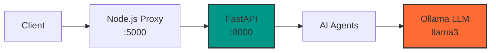

# API Reference

> Complete FastAPI endpoint documentation for CareerSync AI services


## 📋 Table of Contents

- [Overview](#overview)
- [Base URL & Authentication](#base-url--authentication)
- [Request/Response Format](#requestresponse-format)
- [Error Handling](#error-handling)
- [Core Endpoints](#core-endpoints)
  - [Health Check](#health-check)
  - [PDF Processing](#pdf-processing)
  - [Career Analysis](#career-analysis)
  - [Roadmap Generation](#roadmap-generation)
  - [Interview Simulation](#interview-simulation)
- [Data Models](#data-models)
- [Status Codes](#status-codes)
- [Integration Examples](#integration-examples)

---

## Overview

The CareerSync AI API is built with **FastAPI** and provides AI-powered career transition services. All AI processing runs locally via **Ollama** with the **llama3** model, ensuring complete privacy and fast response times.

### Key Features

- **🔒 Privacy-First**: All AI processing runs locally (no external API calls)
- **⚡ High Performance**: FastAPI with async support and local LLM inference
- **🤖 AI-Powered**: Five specialized agents for different career transition tasks
- **📄 PDF Support**: Direct resume PDF parsing and text extraction
- **🎯 Domain-Specific**: Tailored analysis for Healthcare IT, Railway, Finance, and other domains

### Architecture



---

## Base URL & Authentication

### Base URL
```
http://localhost:8000
```

### Authentication
**No authentication required** - The API runs locally and is designed for single-user desktop applications.

### CORS Configuration
The API accepts requests from any origin (`allow_origins=["*"]`) for local development convenience.

---

## Request/Response Format

### Content Type
All requests and responses use `application/json` unless otherwise specified.

### Request Headers
```http
Content-Type: application/json
Accept: application/json
```

### Response Format
All successful responses return JSON with the following structure:

```json
{
  "data": "response_data",
  "status": "success"
}
```

Error responses follow this format:
```json
{
  "detail": "Error description",
  "status_code": 400
}
```

---

## Error Handling

### HTTP Status Codes

| Code | Meaning | Description |
|------|---------|-------------|
| `200` | OK | Request successful |
| `400` | Bad Request | Invalid request data or missing parameters |
| `422` | Unprocessable Entity | Valid JSON but invalid data (e.g., unsupported file type) |
| `500` | Internal Server Error | Server error or AI processing failure |

### Error Response Examples

**400 Bad Request**:
```json
{
  "detail": "No file uploaded.",
  "status_code": 400
}
```

**422 Unprocessable Entity**:
```json
{
  "detail": "Only PDF files are supported.",
  "status_code": 422
}
```

**500 Internal Server Error**:
```json
{
  "detail": "Failed to parse PDF: Invalid PDF format",
  "status_code": 500
}
```

---

## Core Endpoints

### Health Check

#### `GET /`

**Description**: Health check endpoint to verify API availability.

**Parameters**: None

**Response**:
```json
{
  "message": "CareerSync AI running 🚀"
}
```

**Example**:
```bash
curl -X GET "http://localhost:8000/"
```

---

### PDF Processing

#### `POST /parse-pdf`

**Description**: Extracts text content from uploaded PDF resume files.

**Parameters**:
- **file** (form-data, required): PDF file to parse

**Request**:
```http
POST /parse-pdf
Content-Type: multipart/form-data

file: [PDF file binary data]
```

**Response**:
```json
{
  "resume_text": "Extracted text content from the PDF..."
}
```

**Error Cases**:
- **400**: No file uploaded
- **422**: Non-PDF file or corrupted PDF
- **422**: PDF contains no extractable text

**Example**:
```bash
curl -X POST "http://localhost:8000/parse-pdf" \
  -F "file=@resume.pdf"
```

---

### Career Analysis

#### `POST /analyze`

**Description**: Comprehensive career transition analysis including skill extraction, mapping, gap analysis, roadmap generation, and interview preparation.

**Request Body**:
```json
{
  "resume_text": "string",
  "timeline": "string",
  "target_domain": "string"
}
```

**Parameters**:

| Field | Type | Required | Description | Example Values |
|-------|------|----------|-------------|----------------|
| `resume_text` | string | ✅ | Full text content of the resume | "John Doe\nSoftware Engineer..." |
| `timeline` | string | ❌ | Learning timeline (default: "2 days") | "2 days", "1 week", "1 month" |
| `target_domain` | string | ❌ | Target industry (default: "Healthcare IT") | "Healthcare IT", "Railway", "Finance" |

**Response**:
```json
{
  "skills": ["Python", "SQL", "Project Management"],
  "mapped_skills": {
    "Python": "Data Analysis",
    "SQL": "Database Querying"
  },
  "gaps": ["Domain Knowledge", "Healthcare Regulations"],
  "roadmap": {
    "Day 1": ["Healthcare IT Fundamentals", "HIPAA Compliance"],
    "Day 2": ["EHR Systems", "Interview Preparation"]
  },
  "questions": [
    "What interests you about Healthcare IT?",
    "How would you ensure HIPAA compliance?"
  ],
  "confidence_score": "75",
  "dashboard": {
    "skill_scores": [
      {
        "skill": "Python",
        "score": 85,
        "relevance": "High"
      }
    ],
    "job_matches": [
      {
        "title": "Healthcare Data Analyst",
        "company": "Epic Systems",
        "location": "Remote",
        "url": "https://www.linkedin.com/jobs/search/?keywords=Healthcare%20Data%20Analyst",
        "fit_score": 88
      }
    ],
    "insight": "Your technical background shows strong potential for Healthcare IT roles.",
    "action_tip": "Focus on learning HIPAA compliance and EHR systems."
  }
}
```

**AI Agents Used**:
1. **Profile Agent**: Extracts skills from resume text
2. **Mapping Agent**: Maps skills to target domain and identifies gaps
3. **Roadmap Agent**: Generates learning roadmap
4. **Interview Agent**: Creates domain-specific interview questions
5. **Dashboard Agent**: Generates insights and job matches

**Example**:
```bash
curl -X POST "http://localhost:8000/analyze" \
  -H "Content-Type: application/json" \
  -d '{
    "resume_text": "John Doe\nSoftware Engineer with 5 years Python experience...",
    "timeline": "1 week",
    "target_domain": "Healthcare IT"
  }'
```

---

### Roadmap Generation

#### `POST /roadmap/detailed`

**Description**: Generates a detailed 4-phase learning roadmap with curated resources.

**Request Body**:
```json
{
  "timeline": "string",
  "target_domain": "string",
  "skills": ["string"],
  "gaps": ["string"]
}
```

**Parameters**:

| Field | Type | Required | Description |
|-------|------|----------|-------------|
| `timeline` | string | ✅ | Learning timeline |
| `target_domain` | string | ✅ | Target industry domain |
| `skills` | array[string] | ❌ | Existing skills (default: []) |
| `gaps` | array[string] | ❌ | Identified skill gaps (default: []) |

**Response**:
```json
{
  "phases": [
    {
      "phase": "Phase 1",
      "title": "Domain Foundations",
      "description": "Build fundamental knowledge of Healthcare IT systems and regulations.",
      "topics": [
        "Healthcare IT Overview",
        "HIPAA Compliance Basics",
        "EHR System Fundamentals",
        "Healthcare Data Standards"
      ],
      "resources": [
        {
          "title": "Healthcare IT — Coursera",
          "url": "https://www.coursera.org/search?query=Healthcare%20IT"
        },
        {
          "title": "Healthcare IT — YouTube",
          "url": "https://www.youtube.com/results?search_query=Healthcare%20IT"
        }
      ],
      "tip": "Start with HIPAA compliance as it's fundamental to all Healthcare IT roles."
    }
  ]
}
```

**Example**:
```bash
curl -X POST "http://localhost:8000/roadmap/detailed" \
  -H "Content-Type: application/json" \
  -d '{
    "timeline": "1 month",
    "target_domain": "Healthcare IT",
    "skills": ["Python", "SQL"],
    "gaps": ["HIPAA Compliance", "EHR Systems"]
  }'
```

---

### Interview Simulation

The interview system provides a complete simulation experience with progressive difficulty and real-time evaluation.

#### `POST /interview/start`

**Description**: Initializes a new interview session and returns the first question.

**Request Body**:
```json
{
  "target_industry": "string"
}
```

**Parameters**:

| Field | Type | Required | Description |
|-------|------|----------|-------------|
| `target_industry` | string | ❌ | Target industry (uses session data if omitted) |

**Response**:
```json
{
  "question": "Tell me why you are interested in transitioning into Healthcare IT...",
  "questions": ["Tell me why you are interested in transitioning into Healthcare IT..."],
  "question_number": 1,
  "total_questions": 5,
  "difficulty": "Easy"
}
```

**Error Response**:
```json
{
  "error": "Target industry not found in session. Run /analyze first."
}
```

#### `POST /interview/answer`

**Description**: Submits an answer to the current interview question and receives evaluation plus the next question.

**Request Body**:
```json
{
  "answer": "string"
}
```

**Response**:
```json
{
  "evaluation": {
    "relevance": 8,
    "clarity": 7,
    "depth": 6,
    "technical_accuracy": 7,
    "strengths": [
      "You provided specific examples from your background",
      "Clear connection to Healthcare IT made"
    ],
    "weaknesses": [
      "Could elaborate more on regulatory knowledge",
      "Add more technical depth about EHR systems"
    ],
    "improved_answer": "For this question, start with your motivation, describe specific relevant experience, and end with how you plan to bridge any knowledge gaps."
  },
  "next_question": "Describe how you would ensure HIPAA compliance in a data analysis project...",
  "next_question_number": 2,
  "next_difficulty": "Easy-Medium",
  "total_questions": 5,
  "interview_complete": false
}
```

**Final Question Response**:
```json
{
  "evaluation": { /* evaluation object */ },
  "next_question": null,
  "next_question_number": null,
  "next_difficulty": null,
  "total_questions": 5,
  "interview_complete": true
}
```

#### `POST /interview/submit`

**Description**: Submits all answers at once for batch evaluation (alternative to sequential answering).

**Request Body**:
```json
{
  "answers": [
    "Answer to question 1...",
    "Answer to question 2...",
    "Answer to question 3...",
    "Answer to question 4...",
    "Answer to question 5..."
  ]
}
```

**Response**:
```json
{
  "evaluations": [
    {
      "relevance": 8,
      "clarity": 7,
      "depth": 6,
      "technical_accuracy": 7,
      "strengths": ["Specific examples provided"],
      "weaknesses": ["Could add more technical depth"],
      "improved_answer": "Enhanced answer suggestion..."
    }
  ],
  "report": {
    "overall_score": 72,
    "top_strengths": [
      "Strong technical background",
      "Clear communication style",
      "Good problem-solving approach"
    ],
    "key_weaknesses": [
      "Limited domain-specific knowledge",
      "Needs more structured responses",
      "Could improve technical terminology usage"
    ],
    "improvement_roadmap": [
      "Study Healthcare IT regulations and compliance",
      "Practice STAR method for interview responses",
      "Learn industry-specific terminology and tools"
    ],
    "topics_to_study": [
      "HIPAA compliance requirements",
      "EHR system architecture",
      "Healthcare data standards (HL7, FHIR)"
    ]
  },
  "questions": ["Question 1...", "Question 2..."],
  "answers": ["Answer 1...", "Answer 2..."],
  "interview_complete": true
}
```

#### `GET /interview/report`

**Description**: Retrieves the final interview report after completion.

**Parameters**: None

**Response**:
```json
{
  "overall_score": 72,
  "top_strengths": [
    "Strong technical background",
    "Clear communication style",
    "Good problem-solving approach"
  ],
  "key_weaknesses": [
    "Limited domain-specific knowledge",
    "Needs more structured responses"
  ],
  "improvement_roadmap": [
    "Study Healthcare IT regulations",
    "Practice STAR method responses",
    "Learn industry terminology"
  ],
  "topics_to_study": [
    "HIPAA compliance",
    "EHR systems",
    "Healthcare data standards"
  ]
}
```

**Error Response**:
```json
{
  "error": "No interview data found."
}
```

---

## Data Models

### AnalyzeRequest
```typescript
interface AnalyzeRequest {
  resume_text: string;          // Full resume text content
  timeline: string;             // "2 days" | "1 week" | "1 month"
  target_domain: string;        // "Healthcare IT" | "Railway" | "Finance"
}
```

### RoadmapRequest
```typescript
interface RoadmapRequest {
  timeline: string;             // Learning timeline
  target_domain: string;        // Target industry
  skills?: string[];            // Existing skills (optional)
  gaps?: string[];              // Skill gaps (optional)
}
```

### InterviewStartRequest
```typescript
interface InterviewStartRequest {
  target_industry?: string;     // Target industry (optional)
}
```

### InterviewAnswerRequest
```typescript
interface InterviewAnswerRequest {
  answer: string;               // Answer to current question
}
```

### InterviewSubmitRequest
```typescript
interface InterviewSubmitRequest {
  answers: string[];            // Array of 5 answers
}
```

### SkillMapping
```typescript
interface SkillMapping {
  [sourceSkill: string]: string; // Maps source skill to target domain skill
}
```

### SkillScore
```typescript
interface SkillScore {
  skill: string;                // Skill name
  score: number;                // Relevance score (0-100)
  relevance: "High" | "Medium" | "Low"; // Relevance category
}
```

### JobMatch
```typescript
interface JobMatch {
  title: string;                // Job title
  company: string;              // Company name
  location: string;             // Location or "Remote"
  url: string;                  // LinkedIn job search URL
  fit_score: number;            // Fit percentage (80-98)
}
```

### RoadmapPhase
```typescript
interface RoadmapPhase {
  phase: string;                // "Phase 1", "Phase 2", etc.
  title: string;                // Phase title
  description: string;          // Phase description
  topics: string[];             // 4 study topics
  resources: Resource[];        // 5 curated resources
  tip: string;                  // Actionable tip
}
```

### Resource
```typescript
interface Resource {
  title: string;                // Resource title
  url: string;                  // Resource URL
}
```

### InterviewEvaluation
```typescript
interface InterviewEvaluation {
  relevance: number;            // Score 0-10
  clarity: number;              // Score 0-10
  depth: number;                // Score 0-10
  technical_accuracy: number;   // Score 0-10
  strengths: string[];          // 2 strength points
  weaknesses: string[];         // 2 weakness points
  improved_answer: string;      // Suggested improvement
}
```

### InterviewReport
```typescript
interface InterviewReport {
  overall_score: number;        // Overall percentage score
  top_strengths: string[];      // Top 3 strengths
  key_weaknesses: string[];     // Top 3 weaknesses
  improvement_roadmap: string[]; // 3 improvement steps
  topics_to_study: string[];    // 3 study topics
}
```

---

## Status Codes

### Success Codes

| Code | Endpoint | Description |
|------|----------|-------------|
| `200` | `GET /` | Health check successful |
| `200` | `POST /parse-pdf` | PDF parsed successfully |
| `200` | `POST /analyze` | Analysis completed successfully |
| `200` | `POST /roadmap/detailed` | Roadmap generated successfully |
| `200` | `POST /interview/start` | Interview session started |
| `200` | `POST /interview/answer` | Answer evaluated successfully |
| `200` | `POST /interview/submit` | Batch submission processed |
| `200` | `GET /interview/report` | Report retrieved successfully |

### Error Codes

| Code | Common Causes | Resolution |
|------|---------------|------------|
| `400` | Missing required fields, no file uploaded | Check request body and required parameters |
| `422` | Invalid file type, corrupted PDF, empty PDF | Use valid PDF files with extractable text |
| `500` | Ollama not running, AI processing error | Ensure Ollama is running with llama3 model |

---

## Integration Examples

### Complete Career Analysis Workflow

```javascript
// 1. Parse PDF Resume
const formData = new FormData();
formData.append('file', pdfFile);

const pdfResponse = await fetch('http://localhost:8000/parse-pdf', {
  method: 'POST',
  body: formData
});
const { resume_text } = await pdfResponse.json();

// 2. Analyze Career Transition
const analysisResponse = await fetch('http://localhost:8000/analyze', {
  method: 'POST',
  headers: { 'Content-Type': 'application/json' },
  body: JSON.stringify({
    resume_text,
    timeline: '1 week',
    target_domain: 'Healthcare IT'
  })
});
const analysis = await analysisResponse.json();

// 3. Get Detailed Roadmap
const roadmapResponse = await fetch('http://localhost:8000/roadmap/detailed', {
  method: 'POST',
  headers: { 'Content-Type': 'application/json' },
  body: JSON.stringify({
    timeline: '1 week',
    target_domain: 'Healthcare IT',
    skills: analysis.skills,
    gaps: analysis.gaps
  })
});
const roadmap = await roadmapResponse.json();

console.log('Analysis:', analysis);
console.log('Detailed Roadmap:', roadmap);
```

### Interview Simulation Workflow

```javascript
// 1. Start Interview
const startResponse = await fetch('http://localhost:8000/interview/start', {
  method: 'POST',
  headers: { 'Content-Type': 'application/json' },
  body: JSON.stringify({
    target_industry: 'Healthcare IT'
  })
});
const { question } = await startResponse.json();

// 2. Answer Questions Sequentially
let currentQuestion = question;
const answers = [];

for (let i = 0; i < 5; i++) {
  const userAnswer = await getUserInput(currentQuestion);
  answers.push(userAnswer);
  
  const answerResponse = await fetch('http://localhost:8000/interview/answer', {
    method: 'POST',
    headers: { 'Content-Type': 'application/json' },
    body: JSON.stringify({ answer: userAnswer })
  });
  
  const result = await answerResponse.json();
  console.log('Evaluation:', result.evaluation);
  
  if (!result.interview_complete) {
    currentQuestion = result.next_question;
  }
}

// 3. Get Final Report
const reportResponse = await fetch('http://localhost:8000/interview/report');
const report = await reportResponse.json();
console.log('Final Report:', report);
```

### Batch Interview Submission

```javascript
// Alternative: Submit all answers at once
const answers = [
  "I'm interested in Healthcare IT because...",
  "To ensure HIPAA compliance, I would...",
  "My experience with data analysis...",
  "When facing technical challenges...",
  "My 90-day plan would include..."
];

const batchResponse = await fetch('http://localhost:8000/interview/submit', {
  method: 'POST',
  headers: { 'Content-Type': 'application/json' },
  body: JSON.stringify({ answers })
});

const { evaluations, report } = await batchResponse.json();
console.log('All Evaluations:', evaluations);
console.log('Final Report:', report);
```

### Error Handling Example

```javascript
async function analyzeCareer(resumeText, timeline, targetDomain) {
  try {
    const response = await fetch('http://localhost:8000/analyze', {
      method: 'POST',
      headers: { 'Content-Type': 'application/json' },
      body: JSON.stringify({
        resume_text: resumeText,
        timeline,
        target_domain: targetDomain
      })
    });

    if (!response.ok) {
      const error = await response.json();
      throw new Error(`API Error ${response.status}: ${error.detail}`);
    }

    return await response.json();
  } catch (error) {
    console.error('Career analysis failed:', error.message);
    
    // Handle specific error cases
    if (error.message.includes('500')) {
      console.log('Check if Ollama is running with: ollama serve');
    }
    
    throw error;
  }
}
```

### Python Integration Example

```python
import requests
import json

# Career Analysis
def analyze_career(resume_text, timeline="1 week", target_domain="Healthcare IT"):
    url = "http://localhost:8000/analyze"
    payload = {
        "resume_text": resume_text,
        "timeline": timeline,
        "target_domain": target_domain
    }
    
    response = requests.post(url, json=payload)
    
    if response.status_code == 200:
        return response.json()
    else:
        raise Exception(f"API Error: {response.status_code} - {response.text}")

# Interview Simulation
def conduct_interview(target_industry="Healthcare IT"):
    base_url = "http://localhost:8000"
    
    # Start interview
    start_response = requests.post(f"{base_url}/interview/start", 
                                 json={"target_industry": target_industry})
    interview_data = start_response.json()
    
    questions = []
    answers = []
    evaluations = []
    
    current_question = interview_data["question"]
    
    for i in range(5):
        print(f"Question {i+1}: {current_question}")
        user_answer = input("Your answer: ")
        
        # Submit answer
        answer_response = requests.post(f"{base_url}/interview/answer",
                                      json={"answer": user_answer})
        result = answer_response.json()
        
        questions.append(current_question)
        answers.append(user_answer)
        evaluations.append(result["evaluation"])
        
        print(f"Evaluation: {result['evaluation']}")
        
        if not result["interview_complete"]:
            current_question = result["next_question"]
        else:
            break
    
    # Get final report
    report_response = requests.get(f"{base_url}/interview/report")
    final_report = report_response.json()
    
    return {
        "questions": questions,
        "answers": answers,
        "evaluations": evaluations,
        "report": final_report
    }

# Usage
if __name__ == "__main__":
    resume = "John Doe\nSoftware Engineer with Python experience..."
    analysis = analyze_career(resume, "1 week", "Healthcare IT")
    print("Career Analysis:", json.dumps(analysis, indent=2))
    
    interview_results = conduct_interview("Healthcare IT")
    print("Interview Results:", json.dumps(interview_results, indent=2))
```

---

## Related Documentation

- [Architecture Guide](architecture.md) - System design and AI agent architecture
- [User Guide](user-guide.md) - How to use CareerSync AI features
- [Development Setup](development.md) - Local development environment setup
- [AI Agents Guide](ai-agents.md) - Detailed AI agent documentation
- [Troubleshooting](troubleshooting.md) - Common API issues and solutions

---

*This API documentation is automatically updated with each release. For questions or issues, see our [troubleshooting guide](troubleshooting.md) or [contribute improvements](development.md#api-documentation-contributions).*