# CareerSync AI Architecture Documentation

> Comprehensive system architecture and component interaction guide for CareerSync AI

## 📋 Table of Contents

- [System Overview](#system-overview)
- [Three-Tier Architecture](#three-tier-architecture)
- [Component Interactions](#component-interactions)
- [AI Agents Architecture](#ai-agents-architecture)
- [Data Flow Diagrams](#data-flow-diagrams)
- [Integration Points](#integration-points)
- [Technology Stack](#technology-stack)
- [Deployment Architecture](#deployment-architecture)

---

## System Overview

CareerSync AI is built on a **three-tier architecture** pattern that provides clear separation of concerns, scalability, and maintainability. The system enables AI-powered career transitions through intelligent skill mapping, personalized roadmap generation, and interactive interview preparation.

### 🎯 Core Design Principles

- **🔒 Privacy-First**: All AI processing runs locally via Ollama (no external APIs)
- **⚡ Performance**: Local inference eliminates external API latency
- **🛡️ Security**: Frontend never communicates directly with AI services
- **📈 Scalability**: Modular design allows independent scaling of each tier
- **🔄 Maintainability**: Clear separation of concerns and standardized interfaces

### 🏗️ High-Level Architecture

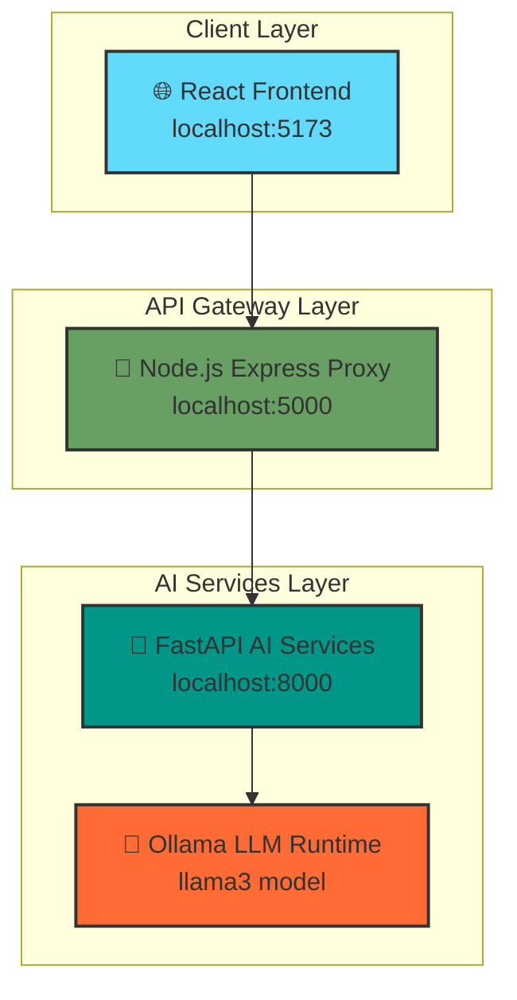

---

## Three-Tier Architecture

### 🎨 Tier 1: Frontend Layer (React/Vite)

**Purpose**: User interface and experience layer
**Technology**: React 18, Vite, Tailwind CSS, React Router
**Port**: 5173

#### Key Components

| Component | File | Purpose |
|-----------|------|---------|
| **App Router** | `src/App.jsx` | Main application routing and state management |
| **Landing Page** | `src/pages/Landing.jsx` | Marketing and onboarding entry point |
| **Pivot Mode** | `src/pages/PivotMode.jsx` | Core career analysis workflow |
| **Dashboard** | `src/pages/Dashboard.jsx` | Results visualization and insights |
| **Roadmap** | `src/pages/Roadmap.jsx` | Learning path visualization |
| **Interview** | `src/pages/Interview.jsx` | Interactive interview simulation |
| **Sidebar Navigation** | `src/components/Sidebar.jsx` | Application navigation |
| **Results Dashboard** | `src/components/ResultsDashboard.jsx` | Data visualization components |

#### Frontend Architecture Pattern

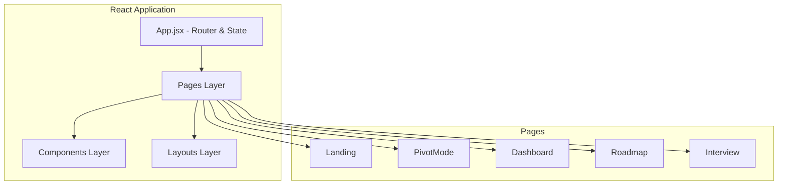

#### State Management

- **Session State**: Pivot results stored in React state for session persistence
- **Route State**: Navigation state managed by React Router
- **Component State**: Local state for UI interactions and form data
- **No External State Management**: Simplified architecture using React's built-in state

### 🔄 Tier 2: API Gateway Layer (Node.js/Express)

**Purpose**: Request routing, security, and API abstraction
**Technology**: Node.js 18+, Express, CORS, Multer
**Port**: 5000

#### Key Responsibilities

- **🛡️ Security Barrier**: Frontend never communicates directly with AI services
- **🔄 Request Proxying**: Routes frontend requests to appropriate AI endpoints
- **📄 File Handling**: PDF upload processing and validation
- **🌐 CORS Management**: Cross-origin request handling
- **⚡ Response Optimization**: Request/response transformation and caching

#### API Endpoints

| Method | Endpoint | Purpose | Target AI Service |
|--------|----------|---------|-------------------|
| `GET` | `/` | Health check | System status |
| `POST` | `/upload-resume` | PDF resume parsing | `/parse-pdf` |
| `POST` | `/analyze` | Complete pivot analysis | `/analyze` |
| `POST` | `/roadmap/detailed` | Detailed roadmap generation | `/roadmap/detailed` |
| `POST` | `/interview/start` | Initialize interview session | `/interview/start` |
| `POST` | `/interview/answer` | Submit interview answer | `/interview/answer` |
| `GET` | `/interview/report` | Final interview report | `/interview/report` |

#### Request Flow Architecture

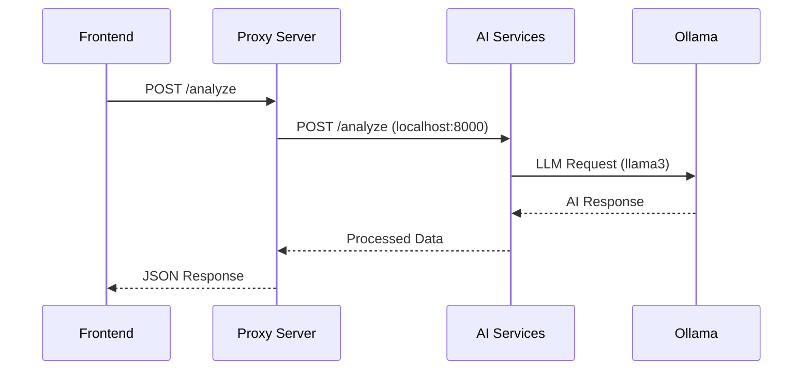

### 🤖 Tier 3: AI Services Layer (FastAPI/Python)

**Purpose**: AI processing, agent orchestration, and business logic
**Technology**: Python 3.9+, FastAPI, LangChain, Ollama
**Port**: 8000

#### Core Architecture

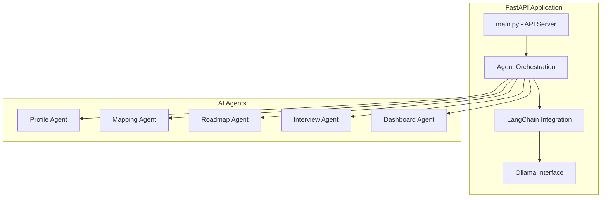

---

## Component Interactions

### 🔄 Primary Data Flow

The system follows a structured data flow pattern for the core Pivot Mode workflow:

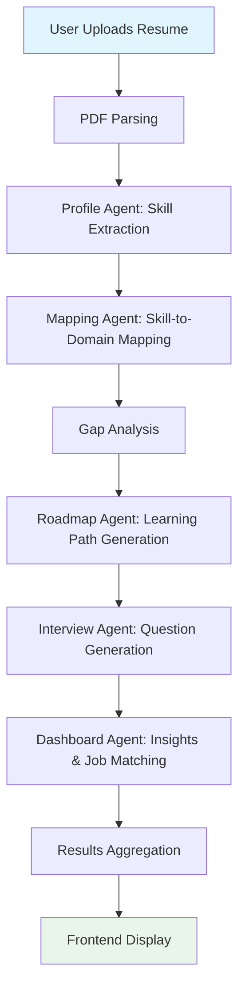

### 🎯 Component Communication Patterns

#### 1. Frontend ↔ Proxy Communication

```javascript
// Frontend API calls (React)
const analyzeResume = async (resumeText, timeline, targetDomain) => {
  const response = await fetch('http://localhost:5000/analyze', {
    method: 'POST',
    headers: { 'Content-Type': 'application/json' },
    body: JSON.stringify({
      resumeText,
      timeline,
      targetDomain
    })
  });
  return response.json();
};
```

#### 2. Proxy ↔ AI Services Communication

```javascript
// Proxy server routing (Node.js/Express)
app.post("/analyze", async (req, res) => {
    try {
        const { resumeText, timeline, targetDomain } = req.body;
        const response = await axios.post("http://127.0.0.1:8000/analyze", {
            resume_text: resumeText,
            timeline: timeline || "2 days",
            target_domain: targetDomain || "Healthcare IT"
        });
        res.json(response.data);
    } catch (error) {
        res.status(500).json({ error: "Analysis failed", detail: error.message });
    }
});
```

#### 3. AI Services ↔ Ollama Communication

```python
# AI agent LLM interaction (Python/LangChain)
from langchain_ollama import ChatOllama
from langchain_core.prompts import PromptTemplate

llm = ChatOllama(model='llama3', format='json')
chain = prompt | llm | parser
result = chain.invoke({"resume": resume_text})
```

---

## AI Agents Architecture

### 🧠 Agent System Overview

CareerSync AI employs a **multi-agent architecture** where specialized AI agents handle different aspects of career analysis and guidance. Each agent is built using **LangChain** and communicates with a local **Ollama llama3** model.

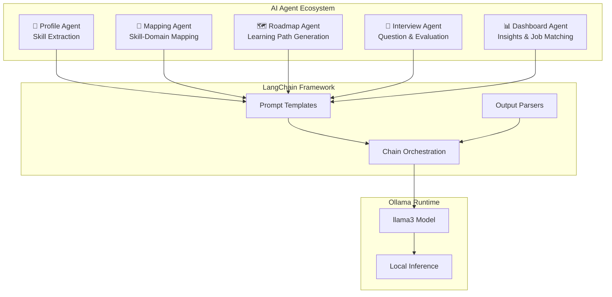

### 🤖 Individual Agent Architecture

#### 👤 Profile Agent (`profile_agent.py`)

**Purpose**: Extract technical and transferable skills from resume text
**Input**: Raw resume text (string)
**Output**: List of extracted skills

```python
# Core functionality
def extract_skills(resume_text: str) -> list:
    prompt = PromptTemplate(
        input_variables=["resume"],
        template="""Extract all technical and transferable skills from resume text.
        Return ONLY a valid JSON array of skill strings."""
    )
    chain = prompt | llm | parser
    return chain.invoke({"resume": resume_text})
```

**Key Features**:
- NLP-based skill identification
- Technical and soft skill categorization
- Fallback handling for API errors
- JSON output parsing and validation

#### 🎯 Mapping Agent (`mapping_agent.py`)

**Purpose**: Map existing skills to target domain and identify gaps
**Input**: Skills list, target domain
**Output**: Mapped skills with relevance scores, identified gaps

```python
# Core functionality
def map_and_analyze(skills: list, target_domain: str) -> dict:
    # Maps skills to domain-specific roles
    # Identifies critical skill gaps
    # Assigns relevance scores (High/Medium/Low)
    return {
        "mapped_skills": [...],
        "gaps": [...]
    }
```

**Key Features**:
- Skill-to-domain relevance scoring
- Gap analysis and prioritization
- Transferable skill identification
- Domain-specific mapping logic

#### 🗺️ Roadmap Agent (`roadmap_agent.py`)

**Purpose**: Generate personalized learning roadmaps with curated resources
**Input**: Timeline, target domain, skills, gaps
**Output**: Phased learning plan with resources

```python
# Core functionality
def generate_detailed_roadmap(timeline: str, target_domain: str, 
                            skills: list, gaps: list) -> list:
    # Creates 4-phase learning roadmap
    # Generates curated resource links
    # Provides actionable study tips
    return phases_with_resources
```

**Key Features**:
- Timeline-based phase planning
- Curated resource link generation (Coursera, YouTube, freeCodeCamp)
- Personalized learning paths
- Progress tracking integration

#### 🎤 Interview Agent (`interview_agent.py`)

**Purpose**: Generate interview questions and evaluate responses
**Input**: Target industry, difficulty level, previous answers
**Output**: Questions, evaluations, final reports

```python
# Core functionality
def generate_interview_question_set(target_industry: str, total_questions: int) -> list:
    # Progressive difficulty (Easy → Hard)
    # Domain-specific question generation
    # Topic coverage tracking
    return questions

def evaluate_interview_batch(target_industry: str, questions: list, answers: list) -> list:
    # 4-dimensional scoring (relevance, clarity, depth, technical accuracy)
    # Strengths and weaknesses identification
    # Improvement suggestions
    return evaluations
```

**Key Features**:
- Progressive difficulty scaling
- Real-time answer evaluation
- Multi-dimensional scoring system
- Comprehensive feedback generation

#### 📊 Dashboard Agent (`dashboard_agent.py`)

**Purpose**: Generate insights, job matches, and confidence metrics
**Input**: Skills, mapped skills, gaps, target domain
**Output**: Skill scores, job matches, insights, action tips

```python
# Core functionality
def generate_dashboard_data(skills: list, mapped_skills: dict, 
                          gaps: list, target_domain: str) -> dict:
    # Skill relevance scoring (0-100)
    # Real job matching with LinkedIn URLs
    # AI-generated career insights
    # Actionable improvement tips
    return dashboard_data
```

**Key Features**:
- Skill relevance scoring algorithm
- Real-time job matching
- Personalized career insights
- Actionable recommendation engine

---

## Data Flow Diagrams

### 🔄 Complete System Data Flow

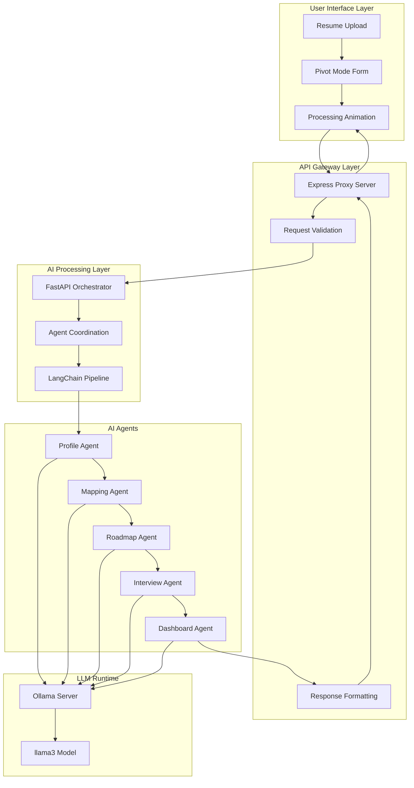

### 🎯 Pivot Mode Workflow

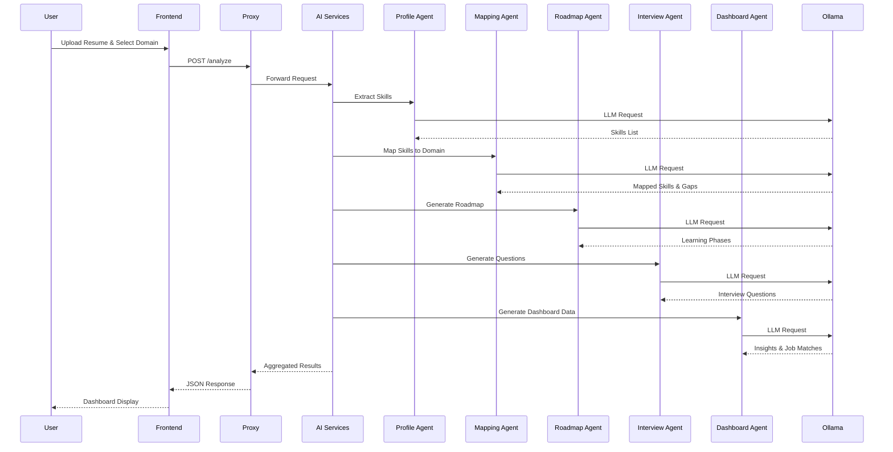

### 🎤 Interview Simulation Flow

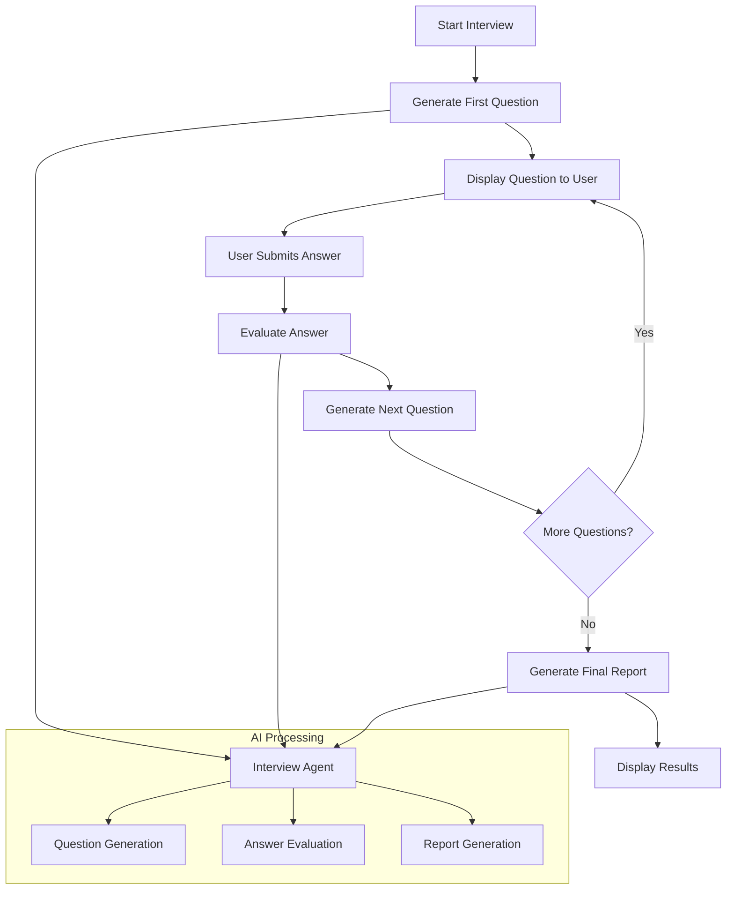

---

## Integration Points

### 🔌 LangChain Integration

CareerSync AI leverages **LangChain** as the primary framework for LLM application development, providing:

#### Core LangChain Components Used

```python
# Standard LangChain imports across all agents
from langchain_ollama import ChatOllama
from langchain_core.prompts import PromptTemplate
from langchain_core.output_parsers import JsonOutputParser

# Standard agent pattern
llm = ChatOllama(model='llama3', format='json')
parser = JsonOutputParser()

def agent_function(input_data):
    prompt = PromptTemplate(
        input_variables=["variable"],
        template="Your prompt template here"
    )
    chain = prompt | llm | parser
    return chain.invoke(input_data)
```

#### LangChain Architecture Benefits

- **🔗 Chain Composition**: Modular prompt → LLM → parser pipelines
- **📝 Prompt Management**: Centralized template management
- **🔄 Output Parsing**: Consistent JSON response handling
- **⚡ Performance**: Optimized LLM interaction patterns
- **🛡️ Error Handling**: Built-in retry and fallback mechanisms

### 🧠 Ollama Integration

**Ollama** provides the local LLM runtime environment with the following integration points:

#### Model Configuration

```python
# Ollama model configuration
MODEL_NAME = "llama3"
MODEL_FORMAT = "json"  # Enforces structured output
BASE_URL = "http://localhost:11434"  # Default Ollama endpoint
```

#### Integration Benefits

- **🔒 Privacy**: All inference runs locally, no data leaves the system
- **⚡ Performance**: No network latency for LLM requests
- **💰 Cost**: No external API costs or usage limits
- **🛡️ Reliability**: No dependency on external service availability
- **🔧 Control**: Full control over model versions and configurations

#### Ollama Service Architecture

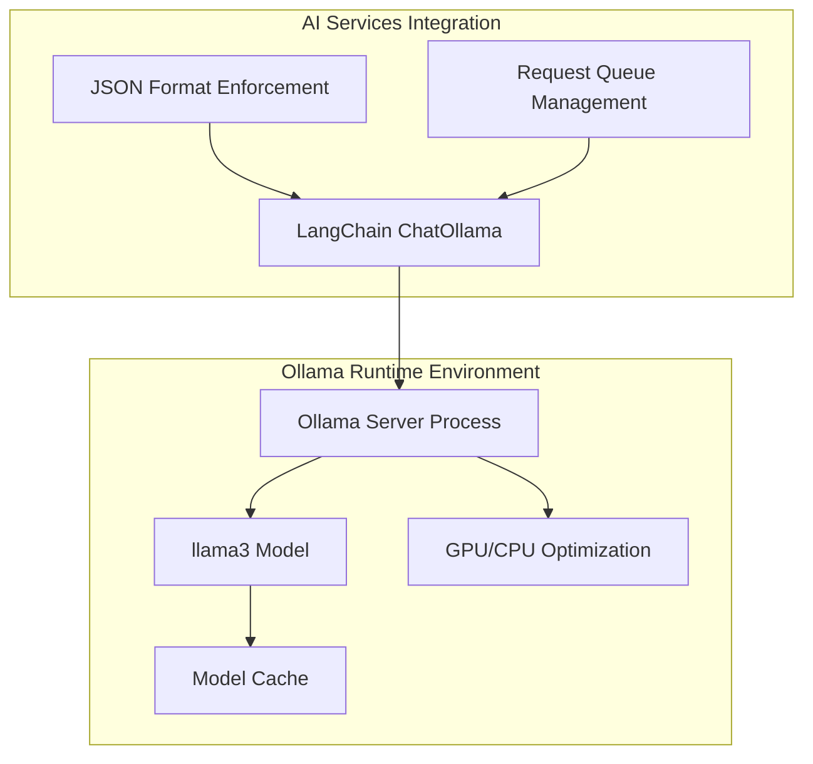

### 🔄 Inter-Service Communication

#### API Contract Standards

All services follow consistent API contract patterns:

```typescript
// Request/Response interfaces
interface AnalyzeRequest {
  resume_text: string;
  timeline: string;
  target_domain: string;
}

interface AnalyzeResponse {
  skills: string[];
  mapped_skills: Record<string, string>;
  gaps: string[];
  roadmap: RoadmapPhase[];
  questions: string[];
  confidence_score: string;
  dashboard: DashboardData;
}
```

#### Error Handling Patterns

```python
# Consistent error handling across all agents
try:
    result = chain.invoke(input_data)
    return process_result(result)
except Exception as e:
    logger.error(f"Agent error: {e}")
    return fallback_response()
```

---

## Technology Stack

### 🎨 Frontend Technologies

| Technology | Version | Purpose | Key Features |
|------------|---------|---------|--------------|
| **React** | 18+ | UI Framework | Component-based architecture, hooks, context |
| **Vite** | Latest | Build Tool | Fast HMR, optimized bundling, dev server |
| **React Router** | 6+ | Routing | Client-side routing, nested routes, navigation |
| **Tailwind CSS** | 4+ | Styling | Utility-first CSS, responsive design, dark mode |

### 🔄 Backend Technologies

| Technology | Version | Purpose | Key Features |
|------------|---------|---------|--------------|
| **Node.js** | 18+ | Runtime | Event-driven, non-blocking I/O, npm ecosystem |
| **Express** | Latest | Web Framework | Middleware support, routing, HTTP utilities |
| **Multer** | Latest | File Upload | Multipart form handling, memory storage |
| **Axios** | Latest | HTTP Client | Promise-based requests, interceptors, error handling |

### 🤖 AI Technologies

| Technology | Version | Purpose | Key Features |
|------------|---------|---------|--------------|
| **Python** | 3.9+ | AI Runtime | Rich ML ecosystem, async support, type hints |
| **FastAPI** | Latest | API Framework | Automatic docs, async support, type validation |
| **LangChain** | Latest | LLM Framework | Chain composition, prompt management, parsers |
| **Ollama** | Latest | LLM Runtime | Local inference, model management, API server |
| **Uvicorn** | Latest | ASGI Server | High-performance async server, WebSocket support |

### 📦 Development Tools

| Tool | Purpose | Configuration |
|------|---------|---------------|
| **npm/yarn** | Package management | Frontend and backend dependencies |
| **pip** | Python package management | AI services dependencies |
| **Git** | Version control | Source code management |
| **VS Code** | Development environment | Extensions for React, Python, Markdown |

---

## Deployment Architecture

### 🚀 Development Environment

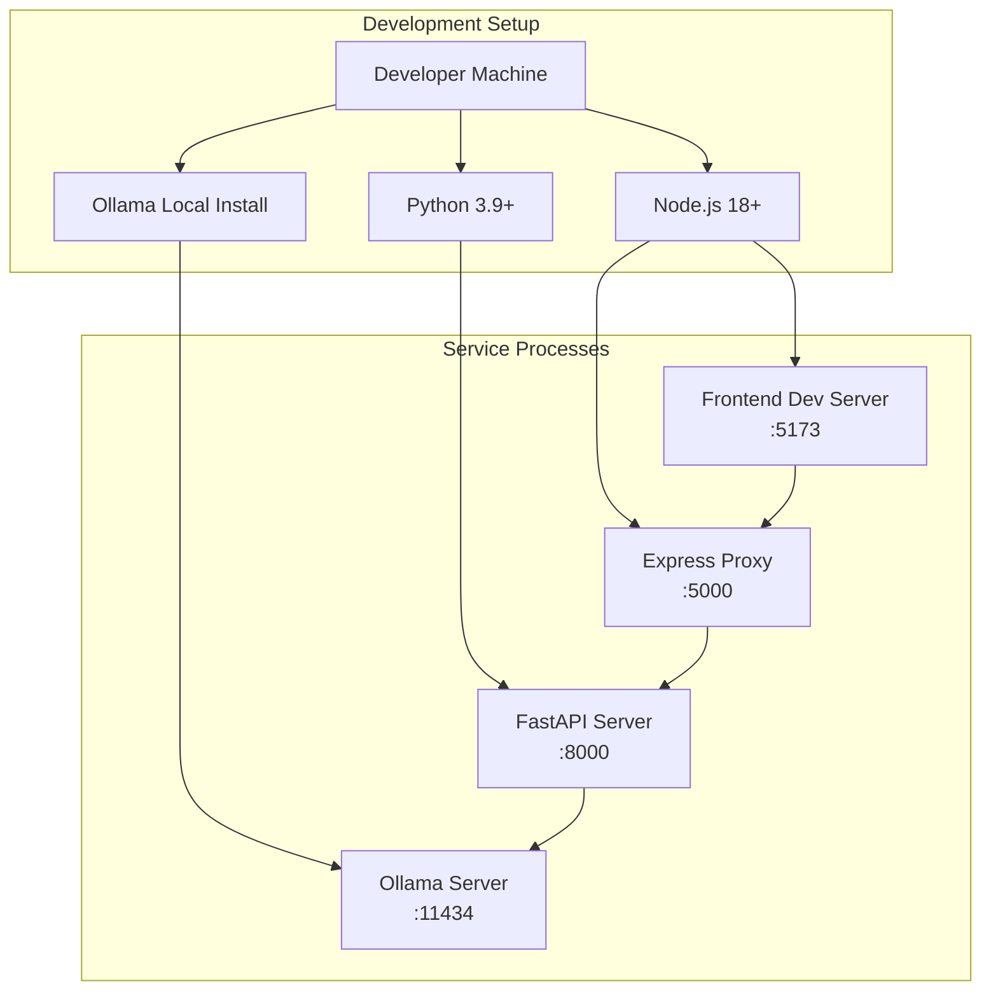

### 🐳 Production Deployment Options

#### Option 1: Docker Compose

```yaml
# docker-compose.yml structure
version: '3.8'
services:
  frontend:
    build: ./frontend
    ports: ["80:80"]
  
  backend:
    build: ./backend
    ports: ["5000:5000"]
  
  ai-services:
    build: ./ai-services
    ports: ["8000:8000"]
  
  ollama:
    image: ollama/ollama
    ports: ["11434:11434"]
    volumes: ["ollama-data:/root/.ollama"]
```

#### Option 2: Kubernetes Deployment

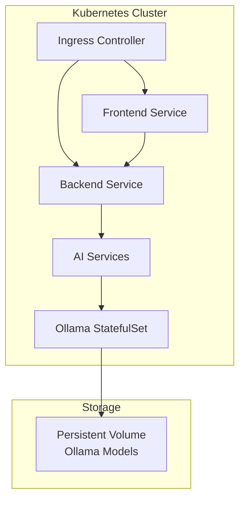

### 🔧 Configuration Management

#### Environment Variables

```bash
# Frontend (.env)
VITE_API_URL=http://localhost:5000

# Backend (.env)
AI_SERVICES_URL=http://localhost:8000
PORT=5000

# AI Services (.env)
OLLAMA_BASE_URL=http://localhost:11434
MODEL_NAME=llama3
```

#### Service Discovery

```python
# AI Services configuration
OLLAMA_CONFIG = {
    "base_url": os.getenv("OLLAMA_BASE_URL", "http://localhost:11434"),
    "model": os.getenv("MODEL_NAME", "llama3"),
    "timeout": int(os.getenv("OLLAMA_TIMEOUT", "30"))
}
```

---

## Performance Considerations

### ⚡ Optimization Strategies

#### Frontend Optimizations

- **Code Splitting**: Route-based lazy loading
- **Asset Optimization**: Image compression, font subsetting
- **Caching**: Browser caching for static assets
- **Bundle Analysis**: Webpack bundle analyzer for size optimization

#### Backend Optimizations

- **Connection Pooling**: HTTP connection reuse
- **Response Compression**: Gzip compression for API responses
- **Request Validation**: Early validation to prevent unnecessary processing
- **Error Handling**: Graceful degradation and fallback responses

#### AI Services Optimizations

- **Model Caching**: Ollama model persistence
- **Batch Processing**: Multiple requests in single LLM calls where possible
- **Prompt Optimization**: Efficient prompt design for faster inference
- **Memory Management**: Proper cleanup of LangChain resources

### 📊 Performance Metrics

| Component | Target Latency | Optimization Focus |
|-----------|----------------|-------------------|
| **Frontend Load** | < 2s | Bundle size, lazy loading |
| **API Response** | < 5s | Request routing, validation |
| **AI Processing** | < 15s | Prompt efficiency, model optimization |
| **Full Pivot Analysis** | < 30s | Agent coordination, parallel processing |

---

## Security Architecture

### 🛡️ Security Layers

#### Network Security

- **API Gateway Pattern**: Frontend never directly accesses AI services
- **CORS Configuration**: Controlled cross-origin access
- **Request Validation**: Input sanitization and validation
- **Rate Limiting**: Protection against abuse (future enhancement)

#### Data Security

- **Local Processing**: No data transmitted to external services
- **Memory Management**: Secure cleanup of sensitive data
- **File Upload Security**: PDF validation and size limits
- **Session Management**: Stateless session handling

#### AI Security

- **Prompt Injection Protection**: Input sanitization for LLM prompts
- **Output Validation**: Structured JSON output parsing
- **Model Isolation**: Local Ollama instance isolation
- **Error Handling**: Secure error messages without data leakage

---

*This architecture documentation provides a comprehensive overview of CareerSync AI's system design. For implementation details, see the [Development Guide](development.md). For API specifications, see the [API Reference](api.md).*

---

## AI Agents and Integration Points

### 🤖 Detailed Agent Specifications

This section provides comprehensive documentation of each AI agent's purpose, functionality, and integration within the CareerSync AI ecosystem.

#### 👤 Profile Agent - Skill Extraction Engine

**File**: `ai-services/agents/profile_agent.py`
**Primary Function**: Extract technical and transferable skills from resume text using NLP

##### Agent Architecture

```python
# Core implementation pattern
from langchain_ollama import ChatOllama
from langchain_core.prompts import PromptTemplate
from langchain_core.output_parsers import JsonOutputParser

llm = ChatOllama(model='llama3', format='json')
parser = JsonOutputParser()

def extract_skills(resume_text: str) -> list:
    prompt = PromptTemplate(
        input_variables=["resume"],
        template="""
        Extract all technical and transferable skills from the following resume text.
        Return ONLY a valid JSON array of skill strings.
        """
    )
    chain = prompt | llm | parser
    return chain.invoke({"resume": resume_text})
```

##### Key Capabilities

- **🔍 Skill Identification**: Automatically identifies technical and soft skills
- **📝 Text Processing**: Handles various resume formats and structures
- **🏷️ Skill Categorization**: Distinguishes between technical and transferable skills
- **🛡️ Error Handling**: Provides fallback skills when processing fails
- **📊 Output Standardization**: Returns consistent JSON array format

##### Integration Points

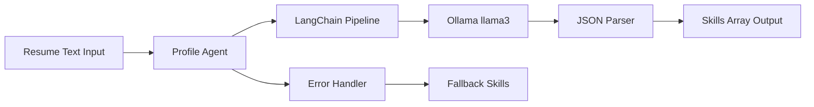

##### Input/Output Specification

```typescript
// Input
interface ProfileAgentInput {
  resume_text: string;  // Raw resume text from PDF or paste
}

// Output
interface ProfileAgentOutput {
  skills: string[];     // Array of extracted skills
}

// Example
Input: "Software engineer with 5 years Python experience..."
Output: ["Python", "Software Engineering", "Problem Solving", "Team Collaboration"]
```

#### 🎯 Mapping Agent - Skill-Domain Translation

**File**: `ai-services/agents/mapping_agent.py`
**Primary Function**: Map existing skills to target domain roles and identify critical gaps

##### Agent Architecture

```python
def map_and_analyze(skills: list, target_domain: str) -> dict:
    prompt = PromptTemplate(
        input_variables=["skills", "target_domain"],
        template="""
        Map each skill to a relevant {target_domain} role or task.
        Identify important missing skills (gaps) for {target_domain}.
        Assign relevance scores: High, Medium, or Low.
        """
    )
    chain = prompt | llm | parser
    return chain.invoke({"skills": str(skills), "target_domain": target_domain})
```

##### Key Capabilities

- **🔄 Skill Translation**: Maps generic skills to domain-specific applications
- **📊 Relevance Scoring**: Assigns High/Medium/Low relevance ratings
- **🔍 Gap Analysis**: Identifies missing skills critical for target domain
- **🎯 Priority Assessment**: Ranks skill gaps by importance
- **📈 Transferability Analysis**: Evaluates how well existing skills transfer

##### Data Flow Architecture

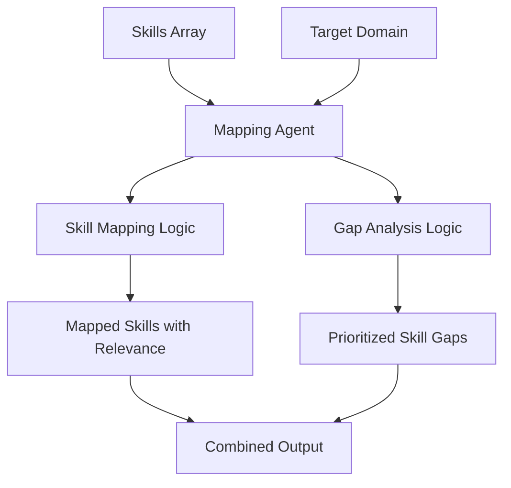

##### Input/Output Specification

```typescript
// Input
interface MappingAgentInput {
  skills: string[];      // Skills from Profile Agent
  target_domain: string; // e.g., "Healthcare IT", "Railway", "Finance"
}

// Output
interface MappingAgentOutput {
  mapped_skills: Array<{
    source: string;      // Original skill
    target: string;      // Domain-specific application
    relevance: "High" | "Medium" | "Low";
  }>;
  gaps: Array<{
    skill: string;       // Missing skill
    priority: "High" | "Medium" | "Low";
  }>;
}
```

#### 🗺️ Roadmap Agent - Learning Path Generator

**File**: `ai-services/agents/roadmap_agent.py`
**Primary Function**: Generate personalized, timeline-based learning roadmaps with curated resources

##### Agent Architecture

```python
def generate_detailed_roadmap(timeline: str, target_domain: str, 
                            skills: list, gaps: list) -> list:
    # Creates exactly 4 phases covering the full timeline
    # Each phase includes topics, resources, and actionable tips
    phases = generate_phases_with_llm()
    
    # Enhance with real resource links
    for phase in phases:
        phase["resources"] = _resource_links(f"{target_domain} {phase['title']}")
    
    return phases

def _resource_links(topic: str) -> list:
    """Build real, clickable resource URLs for a topic"""
    q = quote_plus(topic)
    return [
        {"title": f"{topic} — Coursera", "url": f"https://www.coursera.org/search?query={q}"},
        {"title": f"{topic} — YouTube", "url": f"https://www.youtube.com/results?search_query={q}"},
        {"title": f"{topic} — freeCodeCamp", "url": f"https://www.freecodecamp.org/news/search/?query={q}"},
        {"title": f"{topic} — Medium", "url": f"https://medium.com/search?q={q}"},
        {"title": f"{topic} — Google", "url": f"https://www.google.com/search?q={q}+tutorial+guide"}
    ]
```

##### Key Capabilities

- **📅 Timeline Planning**: Breaks learning into logical time-based phases
- **🎯 Personalization**: Considers existing skills and identified gaps
- **🔗 Resource Curation**: Generates real, clickable links to learning resources
- **📚 Multi-Platform Resources**: Integrates Coursera, YouTube, freeCodeCamp, Medium, Google
- **💡 Actionable Tips**: Provides practical study advice for each phase
- **📊 Progress Structure**: Creates measurable learning milestones

##### Roadmap Generation Flow

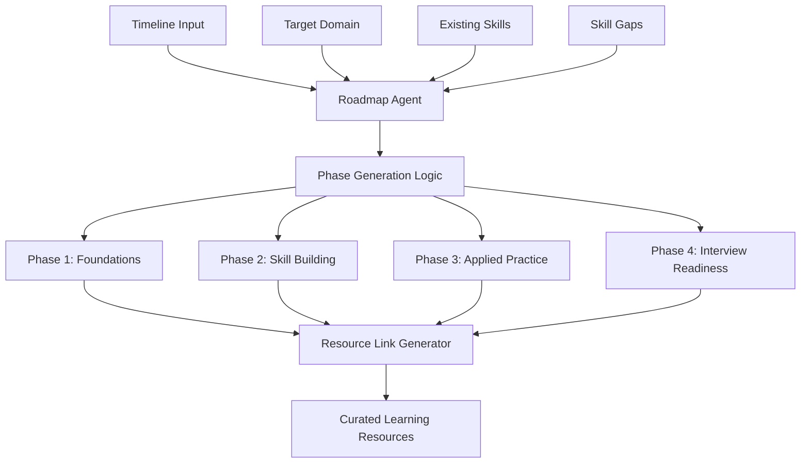

##### Input/Output Specification

```typescript
// Input
interface RoadmapAgentInput {
  timeline: string;      // e.g., "2 days", "1 week", "1 month"
  target_domain: string; // Target career domain
  skills: string[];      // Existing skills
  gaps: string[];        // Identified skill gaps
}

// Output
interface RoadmapAgentOutput {
  phases: Array<{
    phase: string;       // "Phase 1", "Phase 2", etc.
    title: string;       // "Domain Foundations", "Skill Building"
    description: string; // Phase focus description
    topics: string[];    // 4 specific study topics
    resources: Array<{
      title: string;     // Resource title
      url: string;       // Direct link to resource
    }>;
    tip: string;         // Actionable study tip
  }>;
}
```

#### 🎤 Interview Agent - Simulation & Evaluation Engine

**File**: `ai-services/agents/interview_agent.py`
**Primary Function**: Generate progressive interview questions and provide multi-dimensional answer evaluation

##### Agent Architecture

```python
# Question Generation
def generate_interview_question_set(target_industry: str, total_questions: int = 5) -> list:
    questions = []
    topics_covered = []
    
    for idx in range(total_questions):
        difficulty = DIFFICULTY_MAP.get(idx, "Medium")  # Progressive difficulty
        question = generate_interview_question(target_industry, difficulty, topics_covered)
        questions.append(question)
        topics_covered.append(" ".join(question.split()[:6]))  # Track topics
    
    return questions

# Answer Evaluation
def evaluate_answer(target_industry: str, question: str, answer: str) -> dict:
    # 4-dimensional scoring system
    evaluation = {
        "relevance": score_relevance(answer, target_industry),
        "clarity": score_clarity(answer),
        "depth": score_depth(answer),
        "technical_accuracy": score_technical_accuracy(answer, target_industry)
    }
    
    # Generate improvement feedback
    evaluation.update({
        "strengths": identify_strengths(answer),
        "weaknesses": identify_weaknesses(answer),
        "improved_answer": generate_improvement_suggestions(question, answer)
    })
    
    return evaluation
```

##### Key Capabilities

- **📈 Progressive Difficulty**: Questions scale from Easy → Hard across 5 levels
- **🎯 Domain Specificity**: Questions tailored to target industry requirements
- **📊 Multi-Dimensional Scoring**: 4-axis evaluation system (relevance, clarity, depth, technical accuracy)
- **💡 Real-Time Feedback**: Immediate strengths/weaknesses identification
- **🔄 Adaptive Questioning**: Avoids topic repetition through coverage tracking
- **📋 Comprehensive Reporting**: Detailed final assessment with improvement roadmap

##### Interview Simulation Architecture

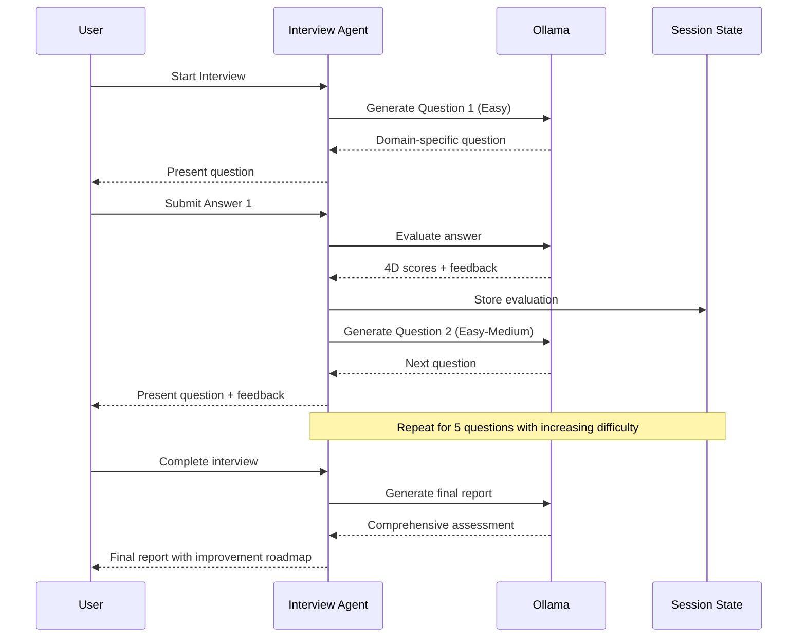

##### Evaluation Dimensions

```typescript
// Evaluation scoring system
interface InterviewEvaluation {
  relevance: number;        // 0-10: Answer relevance to industry/question
  clarity: number;          // 0-10: Communication clarity and structure
  depth: number;            // 0-10: Detail level and insight depth
  technical_accuracy: number; // 0-10: Technical correctness for domain
  
  strengths: string[];      // Identified positive aspects
  weaknesses: string[];     // Areas for improvement
  improved_answer: string;  // Suggested better response approach
}

// Final report structure
interface InterviewReport {
  overall_score: number;           // 0-100: Weighted average of all evaluations
  top_strengths: string[];         // Top 3 strengths across all answers
  key_weaknesses: string[];        // Top 3 areas for improvement
  improvement_roadmap: string[];   // Specific action items
  topics_to_study: string[];       // Recommended study areas
}
```

#### 📊 Dashboard Agent - Insights & Intelligence Engine

**File**: `ai-services/agents/dashboard_agent.py`
**Primary Function**: Generate career insights, job matches, and confidence metrics

##### Agent Architecture

```python
def generate_dashboard_data(skills: list, mapped_skills: dict, 
                          gaps: list, target_domain: str) -> dict:
    """
    Generates comprehensive dashboard data:
    - skill_scores: Relevance scoring for each skill (0-100)
    - job_matches: Real job opportunities with LinkedIn URLs
    - insight: AI-generated career analysis
    - action_tip: Personalized improvement recommendation
    """
    
    # Skill relevance analysis
    skill_scores = analyze_skill_relevance(skills, target_domain)
    
    # Real job matching with LinkedIn integration
    job_matches = generate_job_matches(target_domain, skills)
    
    # AI-powered career insights
    insight = generate_career_insight(skills, gaps, target_domain)
    
    # Actionable recommendations
    action_tip = generate_action_tip(gaps, target_domain)
    
    return {
        "skill_scores": skill_scores,
        "job_matches": job_matches,
        "insight": insight,
        "action_tip": action_tip
    }
```

##### Key Capabilities

- **📊 Skill Scoring Algorithm**: 0-100 relevance scoring with High/Medium/Low categorization
- **💼 Real Job Matching**: Integration with LinkedIn job search URLs
- **🧠 AI Insights Generation**: Personalized career analysis and recommendations
- **🎯 Action Planning**: Specific, actionable improvement suggestions
- **📈 Confidence Metrics**: Overall readiness assessment based on skill gaps
- **🔗 Dynamic URL Generation**: Real-time job search link creation

##### Dashboard Data Flow

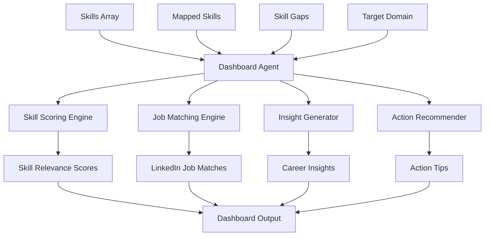

##### Output Specifications

```typescript
// Dashboard data structure
interface DashboardData {
  skill_scores: Array<{
    skill: string;           // Skill name
    score: number;           // 0-100 relevance score
    relevance: "High" | "Medium" | "Low"; // Categorized relevance
  }>;
  
  job_matches: Array<{
    title: string;           // Job title
    company: string;         // Real company name
    location: string;        // Location or "Remote"
    url: string;            // LinkedIn job search URL
    fit_score: number;      // 80-98 fit percentage
  }>;
  
  insight: string;          // 2-sentence career analysis
  action_tip: string;       // Single actionable recommendation
}

// Example job match URL generation
const jobUrl = `https://www.linkedin.com/jobs/search/?keywords=${encodeURIComponent(title)}&location=${encodeURIComponent(location)}`;
```

### 🔗 LangChain Integration Architecture

#### Framework Integration Pattern

All agents follow a consistent LangChain integration pattern that provides:

```python
# Standard LangChain setup across all agents
from langchain_ollama import ChatOllama
from langchain_core.prompts import PromptTemplate
from langchain_core.output_parsers import JsonOutputParser

# Consistent configuration
llm = ChatOllama(
    model='llama3',           # Local Ollama model
    format='json',            # Enforced JSON output
    temperature=0.7,          # Balanced creativity/consistency
    timeout=30                # Request timeout
)

parser = JsonOutputParser()   # Structured output parsing

# Standard chain pattern
def agent_function(input_data):
    prompt = PromptTemplate(
        input_variables=["variable1", "variable2"],
        template="Structured prompt template with {variable1} and {variable2}"
    )
    
    # Chain composition: Prompt → LLM → Parser
    chain = prompt | llm | parser
    
    try:
        result = chain.invoke(input_data)
        return process_result(result)
    except Exception as e:
        logger.error(f"Agent error: {e}")
        return fallback_response()
```

#### LangChain Benefits in CareerSync AI

- **🔗 Chain Composition**: Modular prompt → LLM → parser pipelines
- **📝 Prompt Management**: Centralized, version-controlled prompt templates
- **🔄 Output Parsing**: Consistent JSON response handling across all agents
- **⚡ Performance Optimization**: Efficient LLM interaction patterns
- **🛡️ Error Handling**: Built-in retry mechanisms and graceful degradation
- **📊 Structured Output**: Enforced JSON format for reliable data processing

### 🧠 Ollama Integration Specifications

#### Local LLM Runtime Configuration

```python
# Ollama configuration constants
OLLAMA_CONFIG = {
    "base_url": "http://localhost:11434",  # Default Ollama endpoint
    "model": "llama3",                     # Primary model for all agents
    "format": "json",                      # Enforced structured output
    "timeout": 30,                         # Request timeout in seconds
    "max_retries": 3,                      # Retry attempts on failure
    "temperature": 0.7                     # Balanced creativity/consistency
}

# Model initialization
llm = ChatOllama(**OLLAMA_CONFIG)
```

#### Ollama Service Architecture

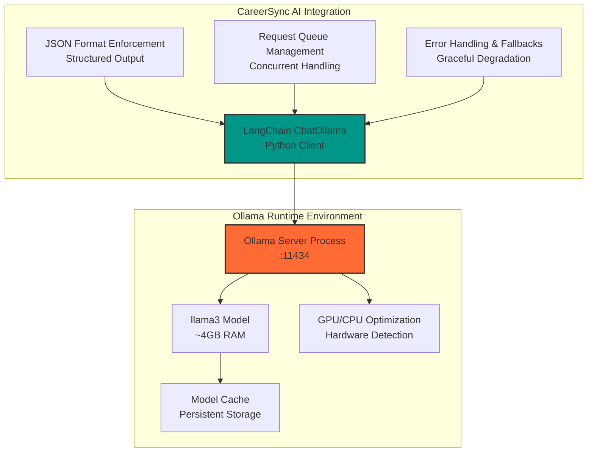

#### Integration Benefits

- **🔒 Privacy Guarantee**: All AI processing remains on local machine
- **⚡ Zero Latency**: No network requests to external AI services
- **💰 Cost Efficiency**: No API usage fees or rate limits
- **🛡️ Reliability**: No dependency on external service availability
- **🔧 Full Control**: Complete control over model versions and configurations
- **📊 Consistent Performance**: Predictable response times and behavior

#### Model Management

```bash
# Ollama model management commands
ollama pull llama3          # Download/update model
ollama list                 # List installed models
ollama show llama3          # Model information
ollama serve                # Start Ollama server
```

### 🔄 Agent Orchestration Patterns

#### Sequential Processing Pattern

For the main `/analyze` endpoint, agents are orchestrated sequentially:

```python
# Main analysis orchestration in main.py
@app.post("/analyze")
def analyze(data: AnalyzeRequest):
    # Step 1: Extract skills from resume
    skills = extract_skills(data.resume_text)
    
    # Step 2: Map skills to target domain
    mapping_data = map_and_analyze(skills, data.target_domain)
    
    # Step 3: Generate learning roadmap
    roadmap = generate_roadmap(data.timeline, data.target_domain)
    
    # Step 4: Generate interview questions
    questions = generate_questions(data.target_domain)
    
    # Step 5: Generate dashboard insights
    dashboard = generate_dashboard_data(skills, mapped_skills, gaps, data.target_domain)
    
    # Step 6: Calculate confidence score
    confidence = calculate_confidence_score(skills, gaps, dashboard)
    
    return aggregate_results(skills, mapping_data, roadmap, questions, dashboard, confidence)
```

#### Parallel Processing Opportunities

Future optimization could implement parallel processing for independent operations:

```python
# Potential parallel processing pattern
import asyncio

async def analyze_parallel(data: AnalyzeRequest):
    # Step 1: Extract skills (required for subsequent steps)
    skills = await extract_skills_async(data.resume_text)
    
    # Step 2: Parallel processing of independent operations
    mapping_task = map_and_analyze_async(skills, data.target_domain)
    roadmap_task = generate_roadmap_async(data.timeline, data.target_domain)
    questions_task = generate_questions_async(data.target_domain)
    
    # Wait for parallel operations to complete
    mapping_data, roadmap, questions = await asyncio.gather(
        mapping_task, roadmap_task, questions_task
    )
    
    # Step 3: Generate dashboard (depends on mapping results)
    dashboard = await generate_dashboard_data_async(skills, mapping_data, data.target_domain)
    
    return aggregate_results(skills, mapping_data, roadmap, questions, dashboard)
```

### 📊 Performance Monitoring

#### Agent Performance Metrics

```python
# Performance monitoring for each agent
import time
import logging

def monitor_agent_performance(agent_name: str):
    def decorator(func):
        def wrapper(*args, **kwargs):
            start_time = time.time()
            try:
                result = func(*args, **kwargs)
                duration = time.time() - start_time
                logging.info(f"{agent_name} completed in {duration:.2f}s")
                return result
            except Exception as e:
                duration = time.time() - start_time
                logging.error(f"{agent_name} failed after {duration:.2f}s: {e}")
                raise
        return wrapper
    return decorator

# Usage example
@monitor_agent_performance("ProfileAgent")
def extract_skills(resume_text: str) -> list:
    # Agent implementation
    pass
```

#### System Performance Targets

| Agent | Target Latency | Typical Response Size | Optimization Focus |
|-------|----------------|----------------------|-------------------|
| **Profile Agent** | < 3s | ~10-20 skills | Prompt efficiency, text processing |
| **Mapping Agent** | < 4s | ~15 mappings + 5 gaps | Domain knowledge, relevance scoring |
| **Roadmap Agent** | < 5s | 4 phases + resources | Resource link generation |
| **Interview Agent** | < 2s per question | 1 question + evaluation | Question diversity, evaluation speed |
| **Dashboard Agent** | < 4s | Scores + jobs + insights | Job matching, insight generation |
| **Complete Analysis** | < 20s | Full pivot results | Agent coordination, parallel processing |

---

*This comprehensive AI agents documentation provides detailed specifications for each component of the CareerSync AI system. For implementation examples, see the [Development Guide](development.md). For API usage, see the [API Reference](api.md).*